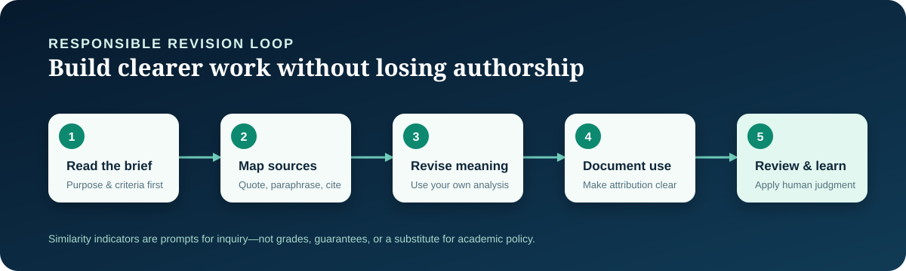
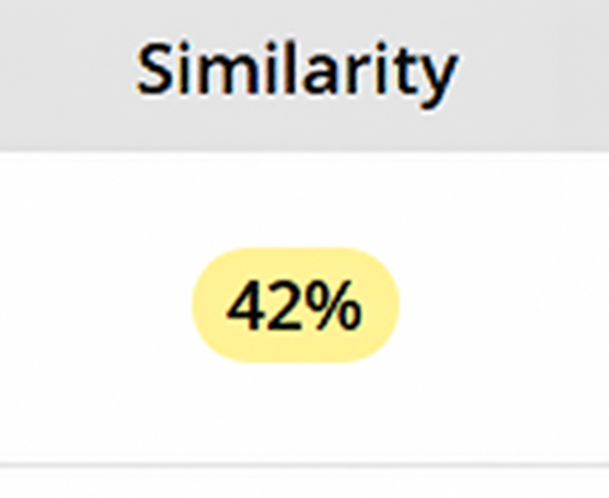
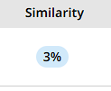

# Plagiarism Audit & Rewrite Skill


> A careful, source-aware workflow for improving academic drafts while protecting the writer’s authorship, meaning, and citations.



## Why this exists

Similarity feedback can be useful, but a percentage alone cannot explain whether writing is appropriately cited, independently reasoned, or aligned with an assignment’s rules. This skill helps turn a flagged passage into a constructive revision conversation: identify what is shared, distinguish legitimate overlap from weak attribution, and strengthen the writer’s own analysis.

It is designed for students, tutors, editors, and educators who want a repeatable review process that keeps academic integrity at the center.

## What it helps you do

- Read assignment requirements before changing prose.
- Trace claims to sources and decide whether to quote, paraphrase, summarize, or cite.
- Revise for clarity and original reasoning rather than cosmetic word swaps.
- Preserve quotations that need to remain quotations and label source use clearly.
- Produce an auditable set of revision notes for human review.

## A responsible revision loop

1. **Read the brief** — establish the learning objective, rubric, citation style, and any tool-use policy.
2. **Map source use** — mark claims, quotations, paraphrases, common knowledge, and missing citations.
3. **Revise meaningfully** — reorganize the argument and explain it in the author’s own voice, retaining the intended meaning.
4. **Document attribution** — add or correct citations, quotation marks, references, and disclosure where required.
5. **Review and learn** — re-read for accuracy, authorial ownership, and compliance with the institution’s policy.

## Illustrative case — not a benchmark

The screenshots below are user-provided illustrations of one individual case: a displayed similarity percentage changed from **42%** to **3%** after revision. They are included to show the kind of before/after context a reviewer may encounter, not as evidence of this skill’s performance.

<table>
  <tr>
    <td width="50%"></td>
    <td width="50%"></td>
  </tr>
  <tr>
    <td align="center"><em>User-provided illustration: before</em></td>
    <td align="center"><em>User-provided illustration: after</em></td>
  </tr>
</table>

Similarity scores depend on the checker, its database, report settings, the document, and timing. This is **not** a certified, guaranteed, or reproducible Turnitin result. A lower percentage does not itself establish good scholarship, and a higher percentage does not itself establish misconduct. Always inspect the matched material and follow your course or institutional process.

## Install in under two minutes

Clone the repository once:

```powershell
git clone https://github.com/octa9999/plagiarism-audit-rewrite-skill.git
cd plagiarism-audit-rewrite-skill
```

### Codex — personal skill (Windows)

```powershell
$destination = Join-Path $env:USERPROFILE ".codex\skills"
New-Item -ItemType Directory -Force $destination | Out-Null
Copy-Item -Recurse .\skills\plagiarism-audit-rewrite $destination
```

Restart Codex, then use `$plagiarism-audit-rewrite` or ask it to audit a draft for attribution gaps and ethical originality improvements. The skill folder uses the standard `SKILL.md` layout described in the [OpenAI Skills documentation](https://developers.openai.com/api/docs/guides/tools-skills).

### Claude Code — project skill

From the project where you want the skill available:

```powershell
$destination = ".claude\skills"
New-Item -ItemType Directory -Force $destination | Out-Null
Copy-Item -Recurse <path-to-clone>\skills\plagiarism-audit-rewrite $destination
```

For all of your Claude Code projects, use `$env:USERPROFILE\.claude\skills` as the destination instead. Start Claude Code in the target project and invoke `/plagiarism-audit-rewrite`, or describe the audit you need. Claude Code recognizes project and user skills stored under `.claude/skills/<name>/SKILL.md`; see the [Claude Code directory reference](https://code.claude.com/docs/en/claude-directory).

### First prompt

```text
Audit this section for attribution gaps and close paraphrasing. Give me a claim map, a revision plan, and citations I need to verify. Preserve the meaning and do not invent sources.
```

Read the full workflow in [the skill instructions](skills/plagiarism-audit-rewrite/SKILL.md) and [the ethical originality reference](skills/plagiarism-audit-rewrite/references/ethical-originality-workflow.md).

## Safety & academic integrity

Use this skill to improve comprehension, attribution, organization, and the expression of your own ideas. Do not use it to conceal copied work, misrepresent authorship, fabricate sources, or override course and institutional requirements.

The final writer remains responsible for:

- verifying every factual claim and reference;
- preserving accurate quotation and citation;
- disclosing assistance when a policy requires it; and
- submitting only work they are permitted to submit.

When in doubt, consult the instructor, librarian, writing center, or institution’s academic-integrity guidance.

## Contributing

Contributions that make the workflow clearer, safer, more accessible, or easier to apply across citation styles are welcome. Please keep changes evidence-based, respect academic-integrity norms, and include a concise explanation of the user benefit and any relevant test or example updates.

Before opening a pull request, read the skill instructions, run the available checks, and avoid adding real student work or personally identifiable information to examples.

## License

See [LICENSE](LICENSE) for licensing information.
